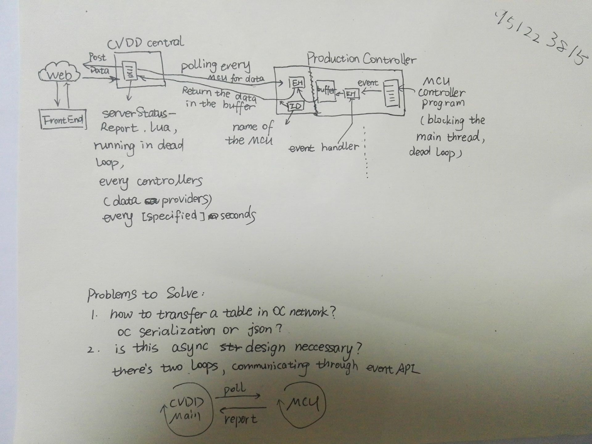

# Developer's Note

## Overall architecture

Oh, the second problem is already solved. This is an optimized solution. But if we don't care about the performance of MCUs, we can just drop the buffer in MCU and let it directly upload data to central. The cost is that MCU's main loop might be blocked when transmitting data.

## Misc

- Opencomputers programs can be terminated by pressing Ctrl+Alt+C
- `internet.request()`can both support HTTPS & HTTP. No other libraries required.
